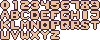
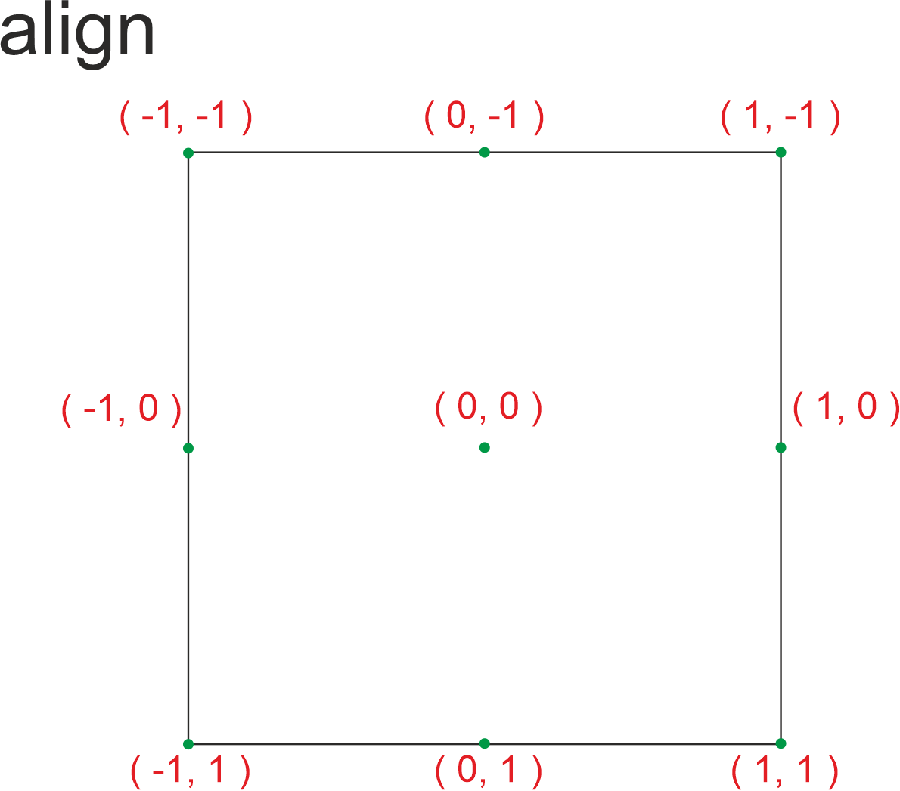

# Spritesheet Font
Generowanie tekstu na podstawie czicionki w pliku z duszkami.


## Technologie
- Python
- PyGame

## Duszki
Znaki wchodzące w skład czcionki należy zapisać w pliku w formacie `*.png` w katalogu `Assets/Fonts`. Znaki w pliku znajdują się w siatce, gdzie w każdym pojedynczym polu siatki znajduje się jeden znak.

<figure>
  <figcaption>fontmain.png</figcaption>
  
</figure>

<figure>
  <figcaption>fontlight.png</figcaption>
  
</figure>

## Klasa `Font`

### Konstruktor

```python
__init__(
    self,
    font: str = "fontlight",
    width: int = 7,
    height: int = 8,
    scale: int = 1,
    alphabet: str = '0123456789ABCDEFGHIJKLMNOPQRSTUVWXYZ!?",.+-=:;$%&'
):
```

argumenty":
- `font` - nazwa pliku z czcionką ( bez formatu pliku ), domyślna czcionka `fontlight`
- `width` - szerokość znaku w pliku z czionką, domyślnie `7`
- `height` - wysokość znaku w pliku z czionką, domyślnie `8`
- `scale` - skala czionki, domyślnie `1` - oryginalny rozmiar
- `alphabet` - ciąg znakowy z domyślnym alfabetem, kolejność znakó musi odpowiadać kolejnośći znaków w pliku graficznym od lewej do prawej, wiersz po wierszu, domyślny alfabet `0123456789ABCDEFGHIJKLMNOPQRSTUVWXYZ!?",.+-=:;$%&`

### Pobranie Surface'a z napisem
Zwraca 

```python
getByWidth(
    self,
    message: str,
    width: int = 0
):
```

argumenty:
- `message` - tekst do wygenerowania,
- `width` - opcjonalny argument, szerokość Surface'a wynikowego z tekstem, domyślnie `0` rozmiar Surface'a tekstu nie będzie ograniczony

wynik:
- `Surface` - zwrócona powierzchnia z wygenerowanym tekstem, powierzchnia nie jest domyślnie umieszczona w głównym oknie aplikacji

### Wygenerowanie tesktu i umieszczenie na głównym ekranie

```python
render( self,
    message: str,
    pos,
    align = ( -1, -1 ),
    width:int = 0
):
```

argumenty:
- `message` - tekst do wygenerowania,
- `pos` - tuple dwóch elementów typu `int` określających położenie powierzchni z tekstem,
- `align` - tuple dwóch elementów typu `int` określających wyrónanie tekstu, domyślnie `( -1, -1 )` gdzie pierwszy element określa położenie w pionie a drugi w poziomie, wartości domyszczalne: `-1`, `0`, `1`,
- `width` - opcjonalny argument, szerokość Surface'a wynikowego z tekstem, domyślnie `0` rozmiar Surface'a tekstu nie będzie ograniczony



wynik:
umieszczenie na ekranie głównym powierzhcni z wygenerowanym tekstem


## Jak użyć
Skrypt korzysta z klas `Asset` oraz `Sprites`. Klasa `Asset` wczytuje pliki z katalogu `Assets`, klasa `Sprites` tnie plik graficzny na pojedyczne duszki i umieszcza je w tablicy.

### Import klasy `Font`
```python
from App.Font import Font
```

### Utworzenie obiektu `Font`
```python
font
